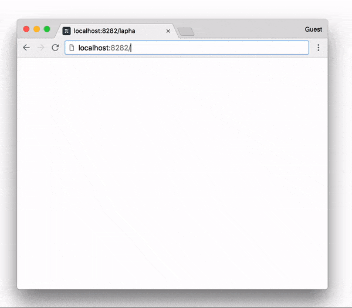

# ghoast
Example of [http-knocking](https://github.com/nwtgck/http-knocking) on Docker Compose for [Ghost](https://ghost.org/), which is a the open source platform for professional publishers.



## Run the server

```bash
cd <this directory>
docker-compose up
```

## Knocking

After running server, go to <http://localhost:8282/>. However, you should see a blank site.


## Knocking procedure

1. Access to http://localhost:8282/alpha  
1. Access to http://localhost:8282/foxtrot  
1. Access to http://localhost:8282/lima  

Then, you will see a [ghost](https://ghost.org/) site!

You can close the site by the reverse order.
