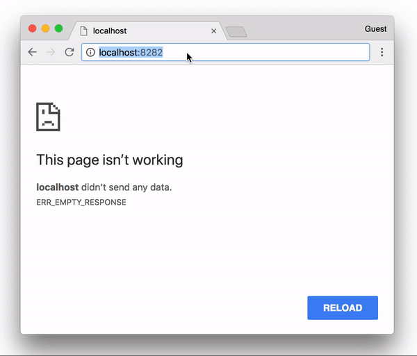

# phpMyAdmin
This example hides your [phpMyAdmin](https://www.phpmyadmin.net/) page.



## Run the server

```bash
cd <this directory>
docker-compose up
```

## Knocking

After running server, go to <http://localhost:8282/>. However, you should see a blank site.


## Knocking procedure

1. Access to http://localhost:8282/alpha  
1. Access to http://localhost:8282/foxtrot  
1. Access to http://localhost:8282/lima  

Then, you will see a phpMyAdmin page!

You can close the site by the reverse order.
